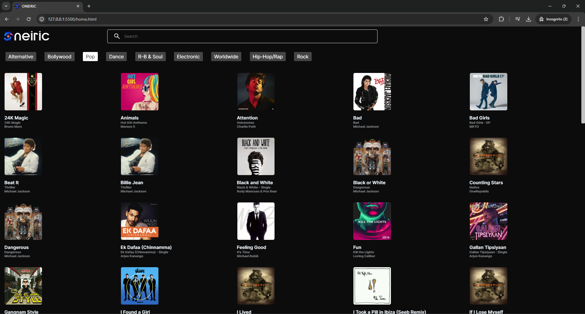
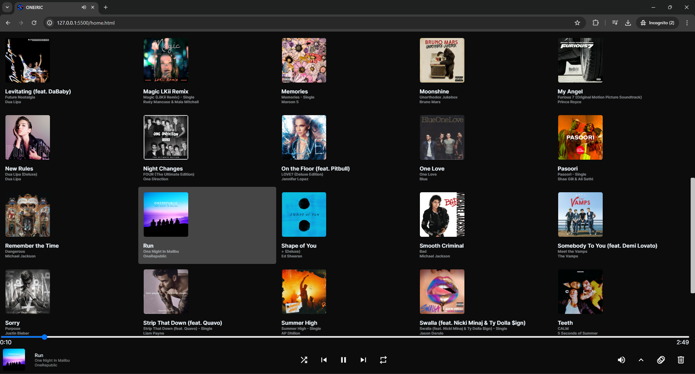
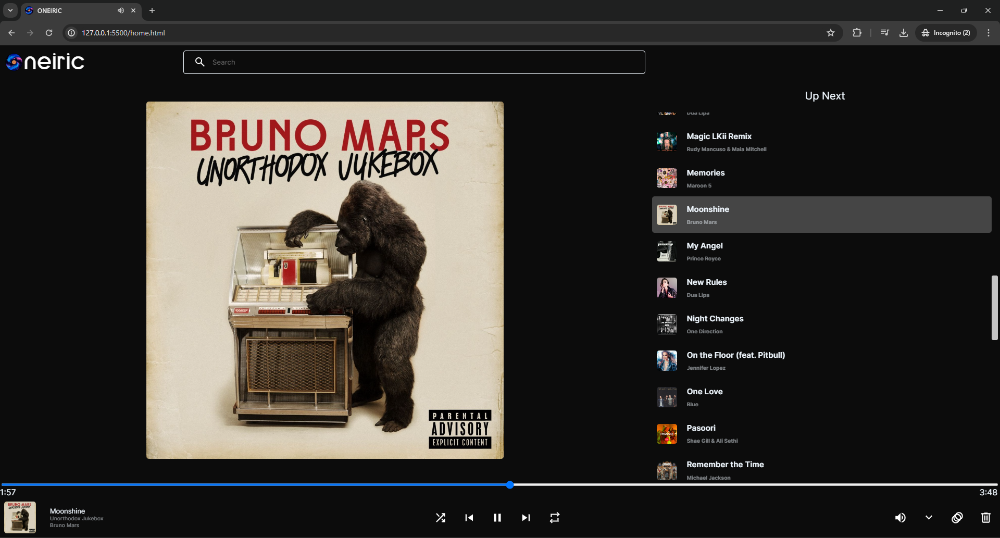
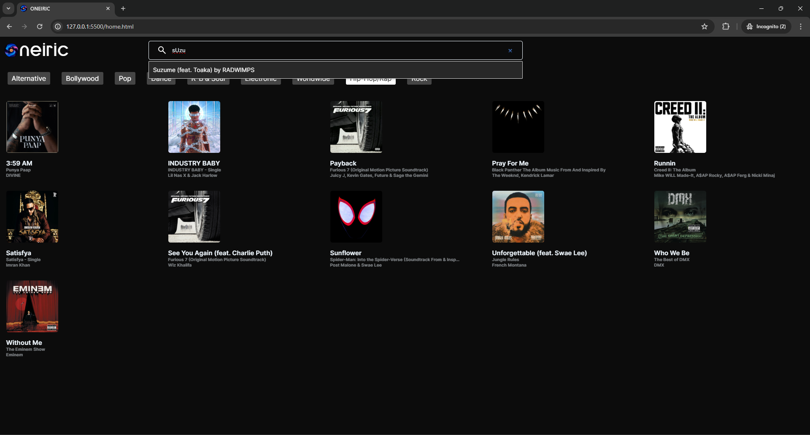
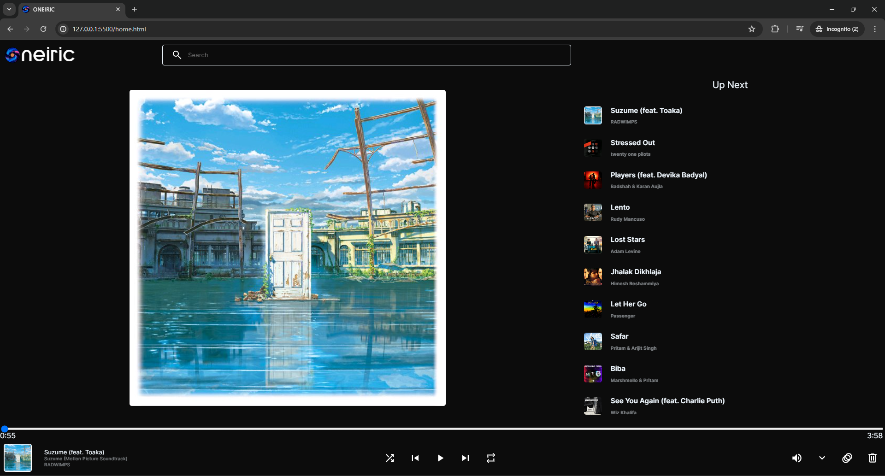
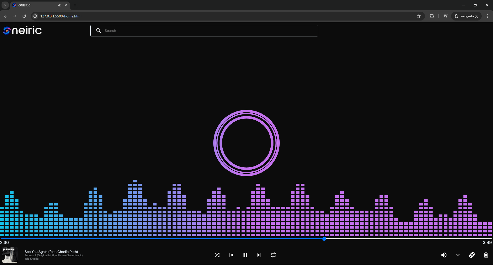

# Oneiric

Oneiric is a simple web-based music player built using HTML, CSS, and JavaScript. It allows users to play their favorite music tracks seamlessly with a visually appealing interface. Users can navigate by genre.

# Images






## Features
- Search
- Next
- Previous
- Play/Pause
- Queue Creation
- Soothing Animation
- Genre Selector

## Prerequisites
The `.mp3` files need to be correctly tagged. You can edit tags using apps such as: 
- [MP3 Tagger](https://play.google.com/store/apps/details?id=com.fillobotto.mp3tagger&hl=en_IN)
- [Automatic Tag Editor](https://play.google.com/store/apps/details?id=tageditor.automatictageditor.audiotagging.audioedit.mp3edit&hl=en_IN)

>[!Note]
>Stay connected to the internet while using Oneiric, as `wave.js` requires an active internet connection to display the sound animations.

## Setup

To run this project, follow the steps below:

1. Install Node.js from: [nodejs.org](https://nodejs.org/en).
2. **music-metadata**: This library is used to extract metadata from audio files.
   ```bash
   npm install music-metadata
   ```
3. Paste your songs into the `\music` directory.
4. Open the terminal in the project directory and run the following commands: 
   - This will create a JSON file containing the metadata of all the songs present in the `\music` directory.
     ```bash
     node read-metadata.js
     ```
   - This will create JSON files based on the songs' genres.
     ```bash
     node sorting.js
     ```
5. Download the ```intro.mp4``` from here [intro.mp4](https://drive.google.com/file/d/1laqpT7H4IYjxZxdDT7Vq_A3NWiqTTIUY/view?usp=sharing) and paste it into ```/animations``` directory
6. Open `\home.html` and change the radio button `value` and `id` attributes to the genre names.
7. Run the whole directory on a local server at `127.0.0.1:5500`.

## Shortcuts
- Next Song:  
  ```Shift + N```
- Previous Song:  
  ```Shift + P```
- Jump to Search:  
  ```/```
- Add Song to a Queue:  
  ```Right Click```

# Dependencies
- [Wave.js](https://github.com/foobar404/Wave.js/)
- [music-metadata](https://www.npmjs.com/package/music-metadata)
